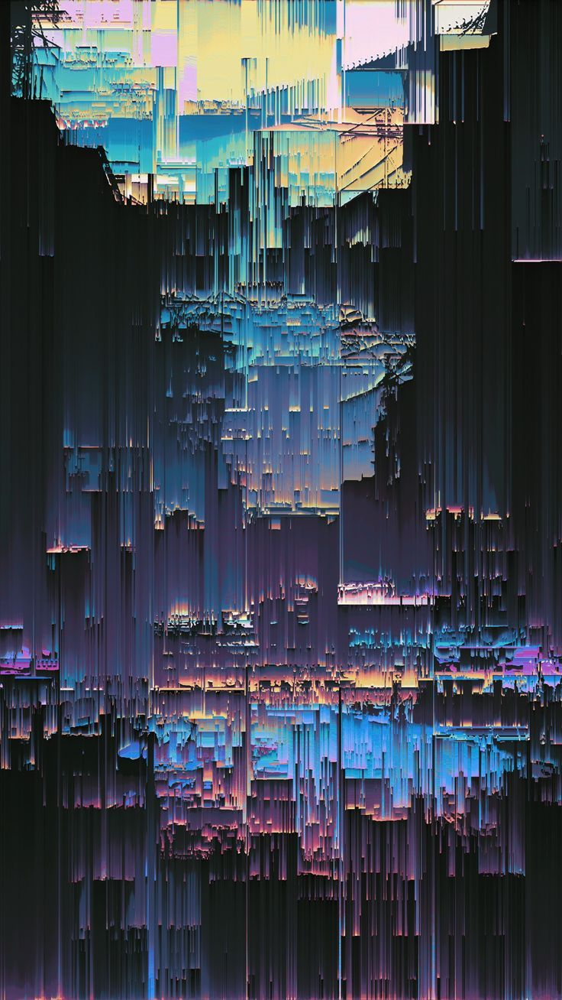
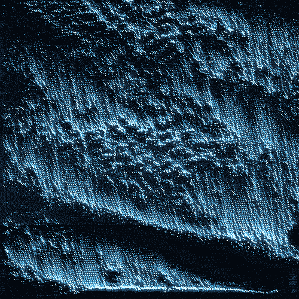

# Week 8 Quiz
- [IDEA9103] Tutorial 1
- Unikey: wzhu0235
- Name: Karina Zhu


## Part 1 – Imaging Technique Inspiration
> As someone who believes creative coding can reveal the beauty of the cyber world, I am particularly inspired by artworks that combine generative visuals with sound design.

I am interested in how **glitch sounds** and **distorted visuals** can interact together, creating an immersive digital atmosphere. For this assignment, I want to explore the Pixel Sorting technique. This technique is suitable for both reinterpreting existing artworks and creating original experimental pieces. By importing my own images into p5.js, I can manipulate pixels to create unexpected visual distortions and abstract cyber aesthetics.




## Part 2 – Coding Technique Exploration
To achieve this visual effect, I explored the `loadPixels()` function in p5.js. This function loads pixel data from the canvas into the **pixels[ ] array**, allowing direct manipulation of image information. By editing pixel values, artists can create effects such as duplication, distortion, glitching, and pixel sorting. This coding technique could help me create reactive cyber visuals that change over time or respond to sound input. Combined with sound design, it could produce an immersive audiovisual experience where both the image and audio influence each other dynamically.
### Example Code Reference
```
let img;

// Load the image.
function preload() {
  img = loadImage('/assets/rockies.jpg');
}

function setup() {
  createCanvas(100, 100);

  // Display the image.
  image(img, 0, 0, 100, 100);

  // Get pixel density.
  let d = pixelDensity();

  // Calculate halfway index.
  let halfImage = 4 * (d * width) * (d * height / 2);

  // Load pixel data.
  loadPixels();

  // Copy top half of image to bottom half.
  for (let i = 0; i < halfImage; i += 1) {
    pixels[i + halfImage] = pixels[i];
  }

  // Update canvas.
  updatePixels();
}
```

### References
[p5.js loadPixels( ) function](https://p5js.org/reference/p5/loadPixels/)

[Javascript sort function](https://developer.mozilla.org/en-US/docs/Web/JavaScript/Reference/Global_Objects/Array/sort)

[Inspiration 1](https://pin.it/5T7GUlh9m) 

[Inspiration 2](https://pin.it/vlcHK9SS1)